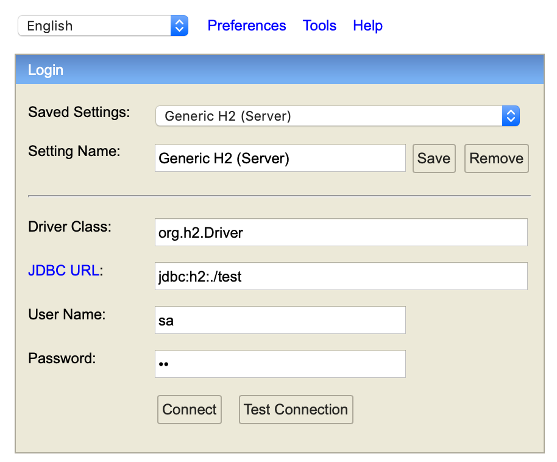
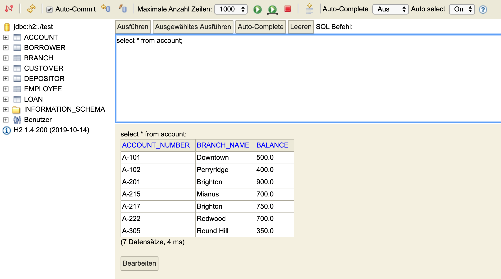

# How to start
 * Clone this repository
 * Start H2 database
 * Log into console
 * Answer the qustions

## Clone the repository
```
git clone <this repo>
```

## Start H2 database
Java have to be installed!
```
java -jar h2-*.jar             
```

## Login into console
Database shloud start on port 8082
Browse to
```
localhost:8082
```
[]
User: sa
 
password: sa

Now shoud have this.
[]